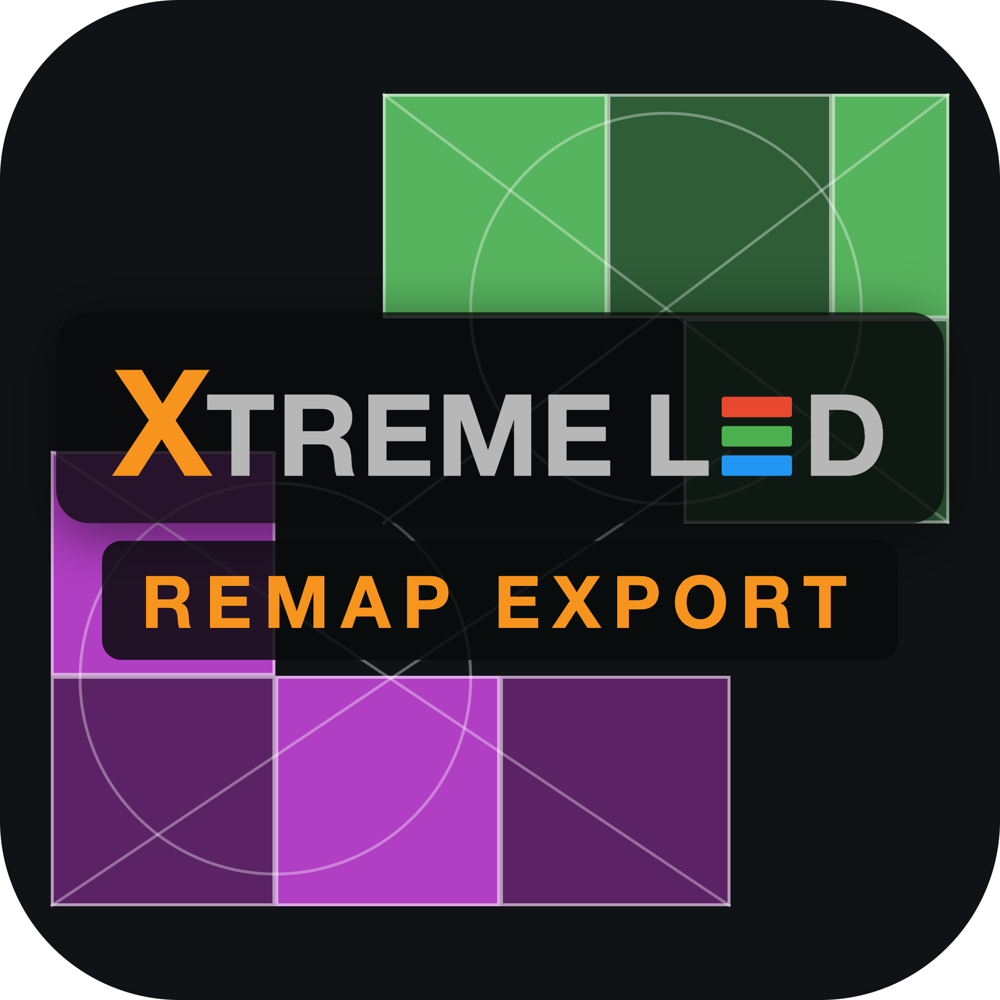
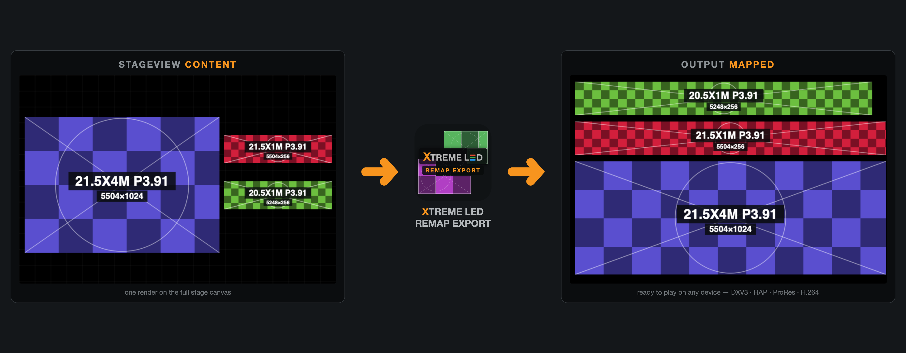
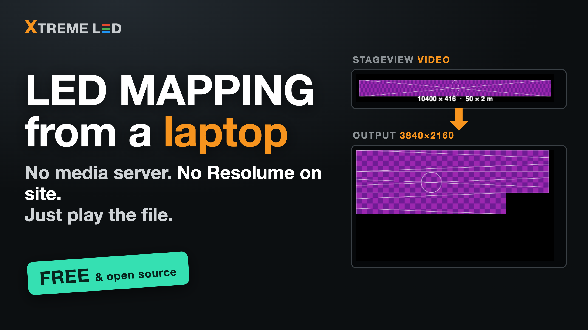
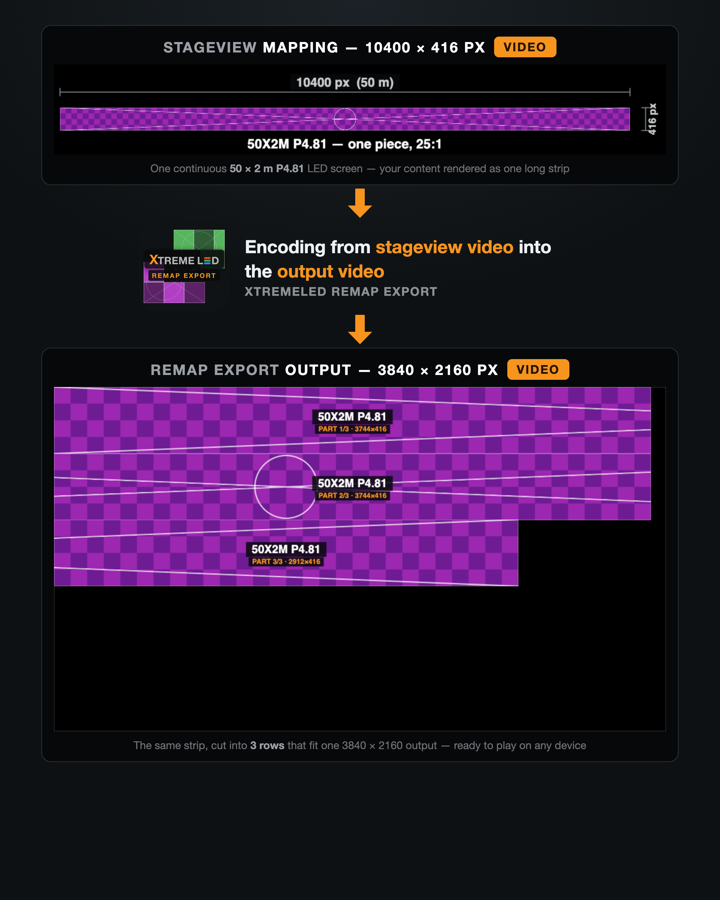
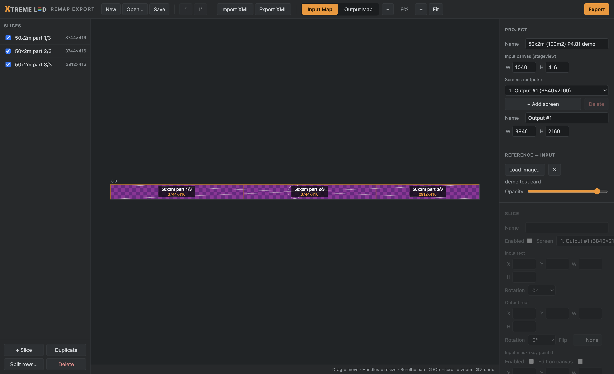
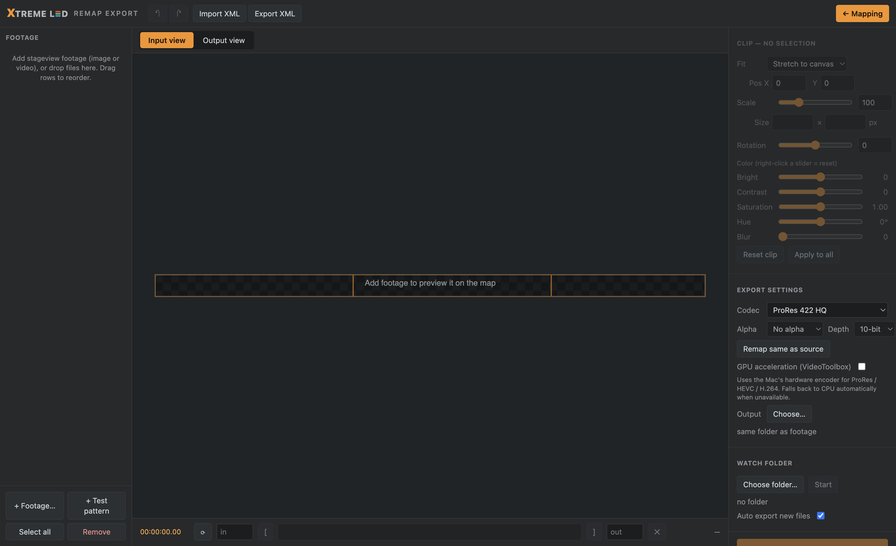

<p align="center">
  
</p>

<h1 align="center">XtremeLED Remap Export</h1>

<p align="center">
  <b>Turn stageview renders into output-mapped LED content — play complex screen mappings from any simple playout device.</b><br>
  <sub>macOS (Intel & Apple Silicon) · Windows · Free & open source · Built for real-world LED shows by <a href="https://www.xtremeled.nl/">XtremeLED</a></sub>
</p>

<p align="center">
  <a href="https://paypal.me/MFoppen/5EUR">
    
  </a>
</p>



<p align="center">
  <a href="https://youtu.be/PxZIOUa16SI">
    <br>
    ▶️ <b>Watch the 90-second walkthrough on YouTube</b>
  </a>
</p>

---

## What does it actually do?

Your LED screen is designed as one big **stageview** canvas (here: a 50 × 2 m P4.81 wall = 10400 × 416 px).
But a normal output only does 3840 × 2160. XtremeLED Remap Export **cuts that one long strip into rows
that fit the output** — encoding your stageview video straight into a ready-to-play output video.

<p align="center">
  
</p>

---

## Why this exists

On a show you don't always have the luxury of a full media-server setup. Sometimes the machine
on site simply can't create a **virtual display** or **slice transforms** to get content onto a
complex LED screen the right way — and renting or licensing a full playout suite (like Resolume
Arena) just to *play a file* is overkill.

**XtremeLED Remap Export flips the problem around:** instead of remapping live at the venue, you
remap the *content itself*, in advance.

1. Load your **stageview render** (the video/image as designed on the full stage canvas).
2. Set up the **input → output mapping** — the exact same slice principle as Resolume's
   Advanced Output (or import your existing Resolume XML or Hippotizer CSV directly).
3. Export. The content is cut, rotated, masked and re-placed into a ready-to-play output file.

The result plays on **any simple playout device** — a laptop with QuickTime, a media player, even
PowerPoint — and lands pixel-perfect on the LED processor. No slice transforms, no virtual
displays, no expensive software on site.

> 🤖 Fun fact: this is XtremeLED's first fully **AI-built** production tool — designed, coded and
> tested end-to-end together with Claude (Anthropic), driven by real LED-show requirements.

## Screenshots

**Mapping page** — input/output slices exactly like Resolume Advanced Output, with masks (key
points), 90° rotation, flip, multi-screen outputs and a live mapped preview:



**Export page** — batch footage with per-clip transform & color, trim timeline with audio
waveform, live input/output preview, test pattern generator and a full codec matrix:



## Features

- **Resolume-compatible XML** import & export — round-trips slices, input masks (polygons),
  rotation and flip. Multiple screens supported.
- **Green Hippo Hippotizer CSV** import & export — read and write VideoMapper tile lists,
  so a mapping can move straight between Hippotizer and Resolume.
- **Slice editor** — drag/resize with snapping and an aspect-ratio lock, key-point masks,
  90° rotations, flip (H/V), split-into-rows for extreme screen sizes (e.g. 50 m × 1 m),
  undo/redo, reorder by dragging.
- **Export codecs**: ProRes 422 Proxy/LT/422/HQ, ProRes 4444 (with/only alpha), **DXV3**,
  **HAP** Standard/Q, HEVC/H.265 (8/10/12-bit), H.264, PNG still / PNG sequence (8/16-bit),
  WAV audio extract (16/24/32-bit).
- **"Remap same as source"** — one click matches the source's codec, bit depth and bitrate.
- **Per-clip control** — fit mode, position (drag with snapping), linked/separate W/H scale with
  exact pixel input, rotation, brightness/contrast/saturation/hue/blur — all live in the preview
  and identical in the ffmpeg render.
- **Trim** — Shutter-Encoder-style timeline with draggable in/out handles, numeric fields and an
  audio waveform.
- **Multiple outputs** — export each screen separately, merged side-by-side, or both.
- **Test pattern generator** — verify your mapping on the real LED wall with slice names, grid
  and circles; use as reference, save as PNG or render to any codec.
- **Watch folder** — drop renders in a folder and they're remapped automatically.
- **GPU acceleration** (VideoToolbox on macOS) with automatic CPU fallback.
- Native **ffmpeg** bundled for Intel Mac, Apple Silicon and Windows — no installation needed.

## Working with other media servers

| Format | Import | Export | Notes |
| --- | --- | --- | --- |
| Resolume Advanced Output `.xml` | ✅ | ✅ | Slices, polygon masks, rotation, flip, multiple screens |
| Green Hippo Hippotizer VideoMapper `.csv` | ✅ | ✅ | Tile rects, rotation, flip, RGB levels, colour block index |

Both live on the toolbar, and you can also just **drag a `.xml` or `.csv` onto the window**.

### Hippotizer VideoMapper CSV

The CSV is the [16-column VideoMapper tile
list](https://www.manula.com/manuals/green-hippo/hippotizer-v4/4.9.4/en/topic/csv-import):
input rect, input rotation and flip, output rect, output rotation, RGB levels and
colour block index. A few things are worth knowing:

- **A header row is optional.** Hippotizer's own spec has none, but exports that have been
  through a spreadsheet usually do — both are read. Export writes the plain headerless form
  the spec describes.
- **A CSV holds no canvas or output resolution.** On import both are derived from how far the
  tiles reach; correct them in the panel on the right if your real canvas is bigger than the
  mapped area.
- **A CSV holds one output.** A project with several screens exports one file per screen.
- **Rotation is snapped to quarter turns.** Hippotizer allows any angle, this app maps in
  90° steps; anything else is snapped and reported on import.
- **Input masks are not written** — the CSV format has no place for them. Use XML if you
  need masks to survive.
- Blank rows and stray leftovers from a spreadsheet are skipped rather than rejected.

## Download

Grab the latest build from the [**Releases**](../../releases) page:

| Platform | File |
| --- | --- |
| macOS — Apple Silicon (M1/M2/M3…) | `XtremeLED Remap Export-<version>-arm64.dmg` |
| macOS — Intel | `XtremeLED Remap Export-<version>-x64.dmg` |
| Windows 10/11 (64-bit) | `XtremeLED Remap Export-<version>-x64.exe` |

### macOS: first launch is blocked ("unidentified developer")

The app is **not notarized** (that needs a paid Apple Developer account), so on first launch
macOS blocks it. This is normal for free apps — you only need to allow it once.

**Recommended — no Terminal needed:**

1. Move **XtremeLED Remap Export.app** to your **Applications** folder and double-click it.
2. macOS shows a warning and refuses. Open  **System Settings → Privacy & Security**.
3. Scroll down to the message *"XtremeLED Remap Export was blocked…"* and click **Open Anyway**.
4. Confirm once — the app opens now and every time after.

**Alternative (Terminal), if the button doesn't appear:**

```bash
xattr -cr "/Applications/XtremeLED Remap Export.app"
```

Both do the same thing — remove the download block. You only need to do this once.

**Windows** may show a "Windows protected your PC" SmartScreen prompt for the same reason — click
**More info → Run anyway**.

## Quick workflow

1. **Mapping page** — set your input canvas to the stageview resolution (e.g. `10400×416` for a
   50×2 m P4.81 screen), add a screen (output) and create slices — or **Import XML** from
   Resolume / **Import CSV** from Hippotizer.
2. Check the mapping with a **test pattern** on the actual LED wall.
3. **Export page** — add your stageview footage, tweak transform/trim if needed, pick a codec
   (DXV3 for Resolume, ProRes for quality, H.264 for PowerPoint/laptops) and hit **Start export**.
4. Play the exported file full-screen on the output — done.

## Run from source

```bash
git clone https://github.com/MikeXtremeLED/xtremeled-remap-export.git
cd xtremeled-remap-export
npm install
npm start          # run the app
npm test           # geometry / XML / CSV / render test suite (45 checks with real ffmpeg renders)
```

### Build installers

```bash
# macOS (both architectures)
npx electron-builder --mac --x64 --arm64

# Windows (cross-build works from macOS/Linux)
./tools/fetch-ffmpeg-win.sh     # one-time: downloads the Windows ffmpeg (149 MB, not in git)
npx electron-builder --win --x64
```

## Notes

- DXV3 encodes as DXT1 ("Normal Quality") — plays natively in Resolume. Notch LC and DXV3 HQ
  have no ffmpeg encoder; use HAP Q or ProRes instead.
- Sources with a different resolution than the input canvas can be fitted/filled/positioned per
  clip; with "Stretch" (default) they're stretched to the canvas.
- Output dimensions are rounded to even numbers where the codec requires it.

## Support this project ☕

XtremeLED Remap Export is free and open source, built in spare time for the LED community.
If it saved you a media server rental (or just some stress on a show), you can
[**buy me a coffee via PayPal**](https://paypal.me/MFoppen/5EUR) — much appreciated! 🧡

## Credits

Concept & field testing: **Mike — XtremeLED** ([xtremeled.nl](https://www.xtremeled.nl/)) ·
Engineering: built with **Claude** (Anthropic) ·
Rendering: [FFmpeg](https://ffmpeg.org/) (bundled builds by evermeet.cx, Martin Riedl and BtbN)
